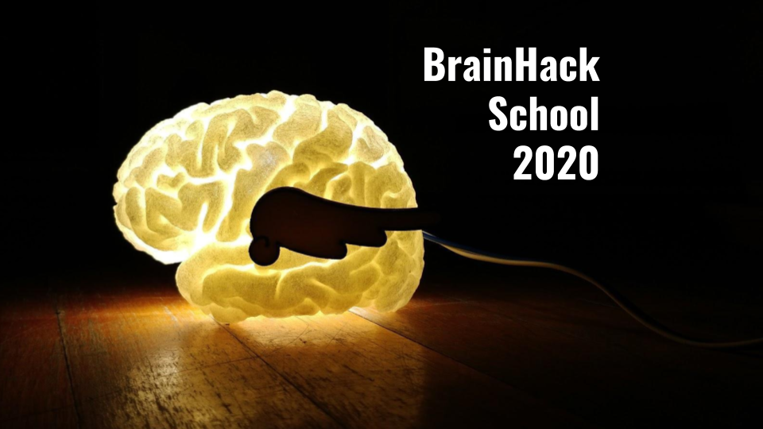

# Diffusion MRI reconstruction project at BrainHack School

Team contributors: Erjun Zhang

## Summary 

I am a first-year PhD student in Biomedical Engineering at Polytechnique Montreal. I am new in this field of MRI and this is my first time to begin an MRI project. The overall goal of this project in BHS is to be familiar with pipeline of diffusion tensor imaging and Python. Thus I can start new project of my study based on this project.

## Project definition 

### Background

Hypoglycemia is a common problem in newborns. Existing research showed that hypoglycemia can lead to serious encephalopathy and brain functional damage, such as visual impairment, epilepsy and cognitive deficits. Additionally, hypoglycemia can cause both transient and permanent structural abnormalities on infant brains. MRI, especially diffusion MRI has a higher in vivo sensitivity to lesions in soft tissues compared to other imaging modalities, and has potential to identify and quantify brain changes.

There are some open-source projects to reconstruct existing diffusion MRI. However, just to use these tools, one may get confused about operations and principle behind them. In addition, this is greatly stop people to finish their long-term goals of diffusion MRI project. Completing the whole process of dMRI is definitely good to new student in this area.

### Tools 

The "Diffusion MRI reconstruction project" will rely on the following technologies: 
 * Python to be the main language used to complete this project.
 * DIPY to be used as analysis package of diffuison MRI data for Python.
 * [Markdown](https://guides.github.com/features/mastering-markdown/), to structure the text.
 * Visual Studio Code to be code editor.
 * qMRLab to load reconstruction results offered by online datasets

### Data 

This project used data from online dataset offered by:
1. The Developing Human COnnectome Project (http://www.developingconnectome.org/second-data-release/). It consists of over 800 neonatal scans and over 250 fetal scans, which can also be used to data analysis after image reconstruction. 
2. PRIME (http://fcon_1000.projects.nitrc.org/indi/PRIMEdownloads.html). I use this one to as test dataset.

### Deliverables

At the end of this project, we will have:
 - Open-source dMRI code based on Python.
 - A diffusion MRI model dedicated to accurate mapping of the microsturture of baby brains. 
 - Adapt to other pipelines
 - Show what has been changed by low blood sugar.
 
Weekly Deliverable
 - Week 1: [Assiginment 2](https://github.com/zhangerjun/Zhang-EJ-QLS612)
 - Week 2: [README file](https://github.com/brainhack-school2020/BHS_Project_dMRI/blob/master/README.md)
 - Week 3: [Data visualization](https://github.com/brainhack-school2020/BHS_Project_dMRI/tree/master/Visualization)
 - Week 4: [Project report]()

## Results 

1. Data Visulization:
  - 3D volume slices image 
  <iframe height=500 width=500 src="https://github.com/brainhack-school2020/BHS_Project_dMRI/blob/master/Visualization/VolumeSlicesImg.gif">
  - Interactive widgets use to show preprocess results 
  
  - Interactive widgets use to shwo reconstruction results 
  <iframe height=500 width=500 src="https://github.com/brainhack-school2020/BHS_Project_dMRI/blob/master/Visualization/ReconstructedImg.gif">
### Progress overview

...
 
## Dependencies

* Operation system: I use Linux (Ubuntu 20.04) to complete this project.
* Python: both Python2 and Python3 were used in this project.
* Jupter and jupyterlab are needed to run jupyter notebooks in this project.
* Dipy (https://dipy.org/)
* Nipype (http://miykael.github.io/nipype-beginner-s-guide/installation.html)
* FSL (https://fsl.fmrib.ox.ac.uk/fsl/fslwiki/FSL). I installed FSL6.0 based on python2 following FslInstallation/Linux (https://fsl.fmrib.ox.ac.uk/fsl/fslwiki/FslInstallation/Linux) and FslInstallation/ShellSetup. In addtion, update Fsl-core is recommended.
* NeuroDebian: To facilitate FSL and Nipype, NeuroDebian is need to be installed. I installed it following http://neuro.debian.net/.
* AMICO (https://github.com/daducci/AMICO)

## Conclusion and acknowledgement

TBD
